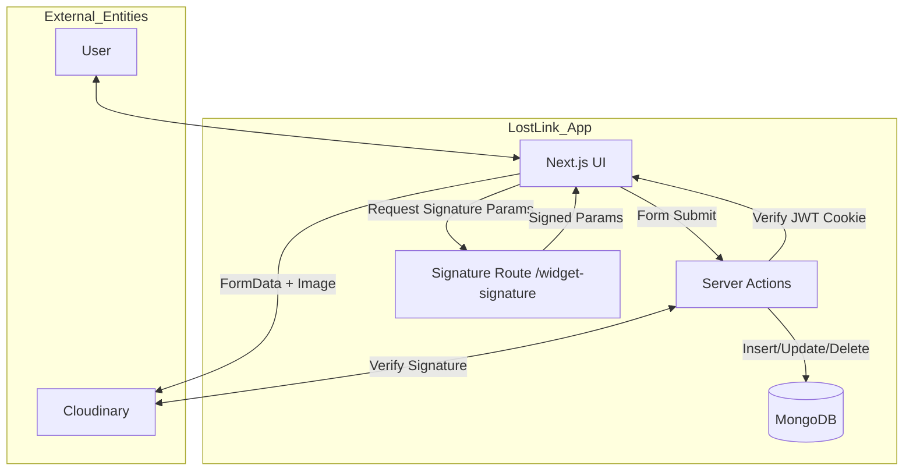
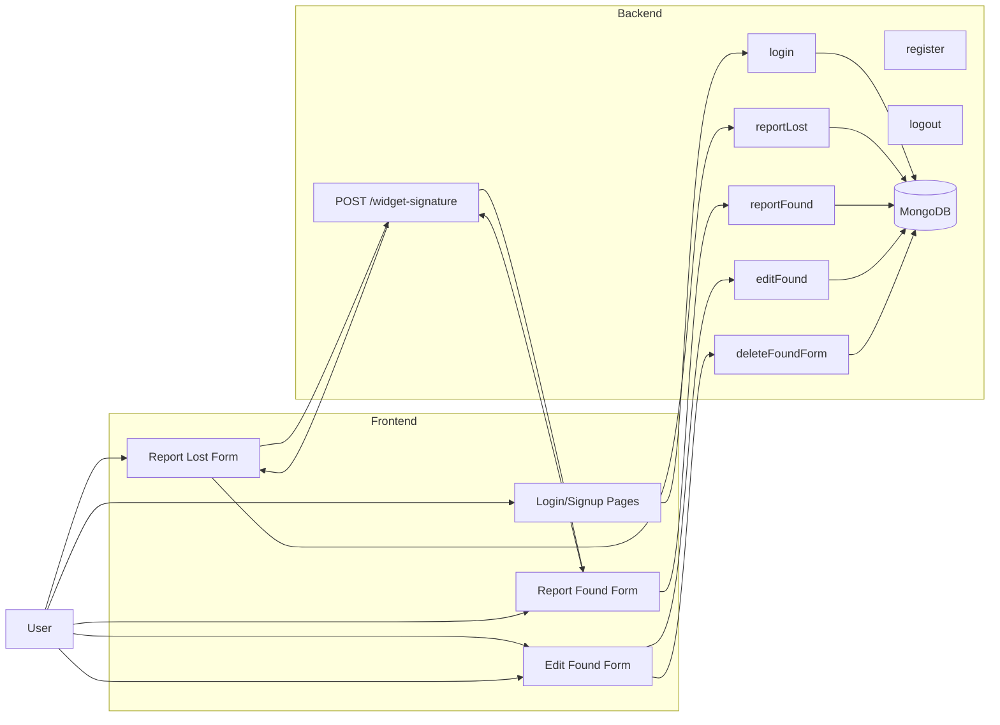
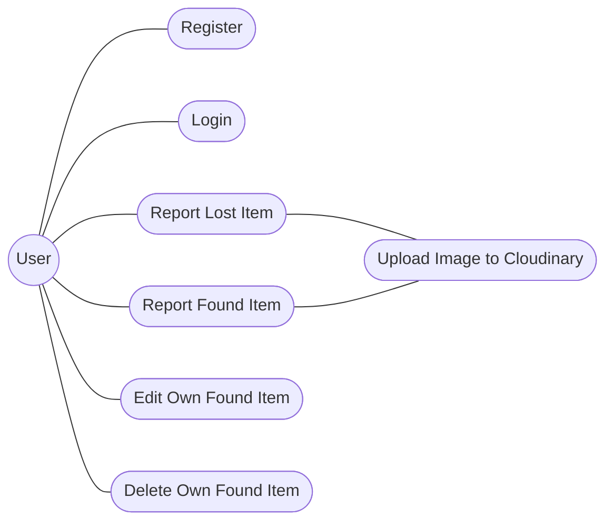
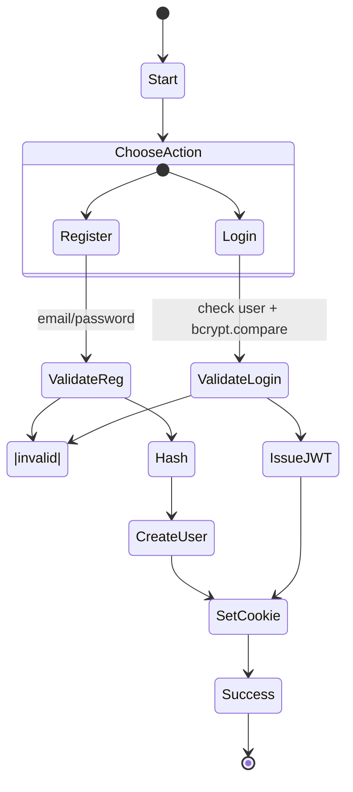
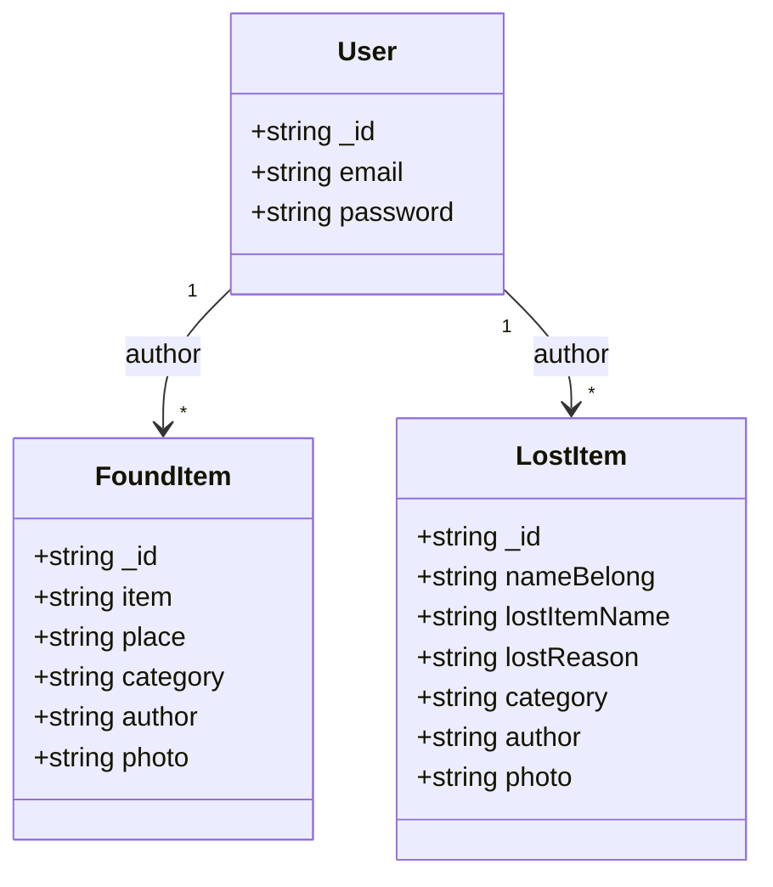
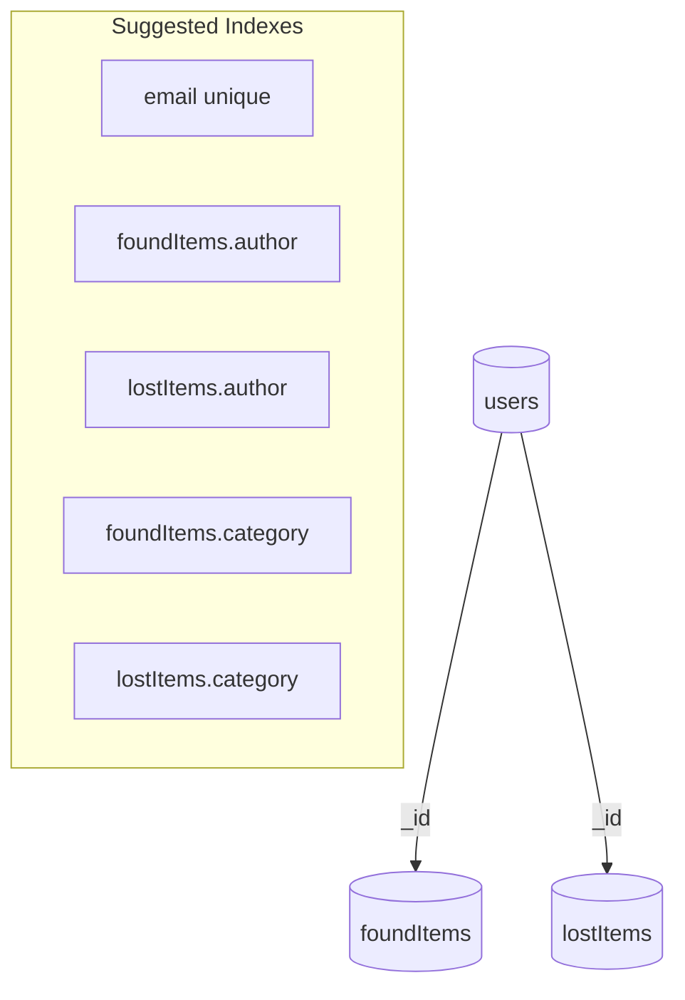

# LostLink - Lost & Found Platform (Next.js)

A full-stack Next.js app for reporting lost items and posting found items. Users can register, log in, create lost/found posts with photos (Cloudinary), edit or delete their own found posts, and browse posts. Data is stored in MongoDB. Authentication uses HTTP-only cookies with JWT.


## Quick Start

```bash
# 1) Install dependencies
npm install

# 2) Set environment variables (.env.local)
# See the Environment Variables section below

# 3) Start the dev server
npm run leebal    # uses next dev --turbopack
# or
npm run dev       # if you add a standard dev script

# 4) Open the app
http://localhost:3000
```


## Scripts

- `leebal`: Start dev server with Turbopack (`next dev --turbopack`)
- `build`: Build the production bundle (`next build`)
- `start`: Run production server (`next start`)
- `lint`: Lint the project (`next lint`)


## Environment Variables
Create a `.env.local` in the project root with:

```bash
# MongoDB
CONNECTIONSTRING="mongodb+srv://<user>:<pass>@<cluster>/<dbName>?retryWrites=true&w=majority"

# Auth (JWT)
JWTSECRET="a-strong-random-secret"

# Cloudinary
NEXT_PUBLIC_CLOUDINARY_CLOUD_NAME="your_cloud_name"
CLOUDINARY_API_KEY="your_api_key"
CLOUDINARY_API_SECRET="your_api_secret"
```

Notes:
- `NEXT_PUBLIC_*` variables are exposed to the client as needed by the Cloudinary widget.
- All other secrets stay on the server.


## Tech Stack
- Next.js 15 (App Router)
- React 19
- TypeScript
- MongoDB (official driver)
- Cloudinary (image upload & signature verification)
- Tailwind CSS 4 (with shadcn/ui building blocks)
- JWT auth with HTTP-only cookies


## Project Structure

```
app/
  layout.tsx              # Root layout
  page.tsx                # Home page (listing/landing)
  blog/page.tsx           # Blog-like listing (if used by UI)
  login/page.tsx          # Login form
  signup/page.tsx         # Registration form
  lostPoster/page.tsx     # Report Lost item form
  report/
    report-found/page.tsx # Report Found item form
    report-lost/page.tsx  # Alternative Lost form (if used)
  edit-foundItems/[id]/page.tsx  # Edit a found item by id
  widget-signature/route.ts      # Cloudinary signature API

actions/
  foundController.ts      # reportFound, editFound, deleteFoundForm
  lostController.ts       # reportLost
  userController.ts       # register, login, logout

components/
  ... UI components (cards, forms, navbars, shadcn/ui)

lib/
  db.ts                   # MongoDB client + getCollection
  getUser.ts              # Read and verify JWT from cookie
  utils.ts                # Misc utilities (if used)
```


## Data Model (MongoDB)
Collections used:
- `users`: `{ _id, email, password }` where `password` is bcrypt-hashed
- `foundItems`: `{ _id, item, place, category, author:ObjectId, photo:public_id }`
- `lostItems`: `{ _id, nameBelong, lostItemName, lostReason, category, author:ObjectId, photo:public_id }`


## Authentication
- Users register and log in via `actions/userController.ts`.
- On login/register success, a JWT is created with `userId` and stored in an HTTP-only cookie `lostlink`.
- `lib/getUser.ts` reads and verifies the cookie/JWT using `JWTSECRET`.
- Server actions and routes validate the user before allowing protected operations.


## Image Uploads (Cloudinary)
- Client uploads use the Cloudinary widget. The app provides a signature endpoint at `app/widget-signature/route.ts`.
- The signature route verifies the user, then signs parameters using `CLOUDINARY_API_SECRET` and returns `{ signature }`.
- On the server actions, uploads are verified by recomputing `api_sign_request` and comparing the `signature`. If valid, the `public_id` is persisted as the `photo` field.


## Server Actions
Key actions (server-only):

- Lost items (`actions/lostController.ts`)
  - `reportLost(prevState, formData)`
    - Requires auth
    - Validates: `nameBelong`, `lostItemName`, `lostReason`, `photo`
    - Verifies Cloudinary signature
    - Inserts into `lostItems`
    - Redirects to `/`

- Found items (`actions/foundController.ts`)
  - `reportFound(prevState, formData)`
    - Requires auth
    - Validates: `name` (item), `place`, `photo`
    - Verifies Cloudinary signature
    - Inserts into `foundItems`
    - Redirects to `/`
  - `editFound(prevState, formData)`
    - Requires auth
    - Validates payload like `reportFound`
    - Ensures current user is the `author`
    - Updates the found document by `_id`
    - Redirects to `/`
  - `deleteFoundForm(formData)`
    - Requires auth
    - Ensures current user is the `author`
    - Deletes the found document by `_id`
    - Redirects to `/`

- Users (`actions/userController.ts`)
  - `register(prevState, formData)`
    - Validates email/password (length, format)
    - Ensures email uniqueness
    - Hashes password with bcrypt
    - Creates user and sets `lostlink` cookie (JWT)
  - `login(prevState, formData)`
    - Validates credentials; sets `lostlink` cookie (JWT)
  - `logout()`
    - Deletes `lostlink` cookie; redirects to `/`


## Forms and Validation
- Server actions re-validate all inputs (length, emptiness) and normalize values.
- Error objects are returned to the client when validation fails. Client components should render these messages near fields.


## Running Locally
1) Ensure MongoDB connection string and all secrets are configured in `.env.local`.
2) Start the dev server with `npm run leebal` (or a `dev` script you add).
3) Visit `http://localhost:3000`.


## Deployment
- Ensure all env vars are set in the hosting platform (e.g., Vercel Project Settings):
  - `CONNECTIONSTRING`, `JWTSECRET`, `NEXT_PUBLIC_CLOUDINARY_CLOUD_NAME`, `CLOUDINARY_API_KEY`, `CLOUDINARY_API_SECRET`.
- Build with `npm run build` and run with `npm start` (platform usually handles this).


## Troubleshooting
- MongoDB connection errors: verify `CONNECTIONSTRING` and network access (IP allowlist if Atlas).
- Auth not working: ensure `JWTSECRET` is set consistently in all environments.
- Image upload failing: confirm Cloudinary credentials and that the signature endpoint is reachable and the user is authenticated.
- 401/redirects from actions: user likely not logged in or not the author of the document.


## Diagrams

### Context-Level DFD


### Level 1 DFD (Core Flows)


### Level 2 DFD (Report Found Item)
```mermaid
flowchart TD
  U[Authenticated User]
  FF[Found Form]
  Sig[Sign Params]
  Verify[Verify Signature]
  Validate[Validate Fields]
  Insert[Insert foundItem]
  DB[(foundItems Collection)]
  Cloud[Cloudinary]

  U --> FF
  FF -->|Request signature with paramsToSign| Sig
  Sig -->|signature| FF
  FF -->|Upload file with signature| Cloud
  FF -->|Submit FormData (name, place, category, public_id, version, signature)| Validate
  Validate --> Verify
  Verify -->|Valid| Insert --> DB
  Verify -->|Invalid| FF
```

### Use Case Diagram (Overview)


### Activity Diagram (User Registration/Login)


### ER Diagram
```mermaid
erDiagram
  USERS ||--o{ FOUND_ITEMS : author
  USERS ||--o{ LOST_ITEMS  : author

  USERS {
    string _id
    string email
    string password // bcrypt hashed
  }

  FOUND_ITEMS {
    string _id
    string item
    string place
    string category
    string author // ObjectId -> USERS._id
    string photo  // Cloudinary public_id
  }

  LOST_ITEMS {
    string _id
    string nameBelong
    string lostItemName
    string lostReason
    string category
    string author // ObjectId -> USERS._id
    string photo  // Cloudinary public_id
  }
```

### Class Diagram (Logical Model)


### Data Model (Collections & Index Ideas)



